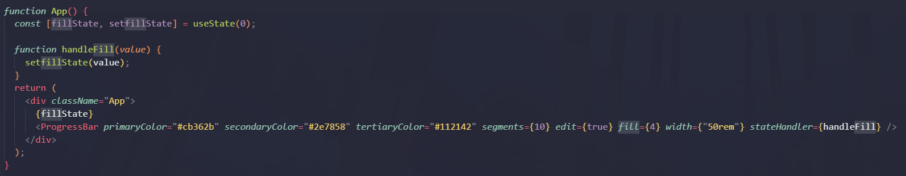

# React-Interactive-Progress-Bar

## Overview

### React Interactive Progress Bar

A simple React component for creating a simple customizable interactive progress bar.
Use cases:

- Keep track of progress for different elements in segments
- Interactive widget for selecting values in customizable segments
- Health Bar! Progress Bar! Resource Bar!

## How to Use

#### install npm package

`npm install react-interactive-progress-bar`

#### Put it into your project

#### No props passed

`<ProgressBar />`:\

#### {primaryColor, secondaryColor, tertiaryColor} props passed (strings)

- primaryColor for fill color
- secondaryColor for negative fill color
- tertiaryColor for border, notches, outline, edit arrow colors

      <ProgressBar primaryColor="#cb362b" secondaryColor="#2e7858" tertiaryColor="#112142" />

  

#### {segments} props passed to define number of sections

    <ProgressBar primaryColor="#cb362b" secondaryColor="#2e7858" tertiaryColor="#112142" segments={10} />

#### {edit} props passed to toggle user interactivity / disable

    <ProgressBar primaryColor="#cb362b" secondaryColor="#2e7858" tertiaryColor="#112142" segments={10} edit={false} />

#### {fill, width} props passed to predefine # segments filled and width of bar

    <ProgressBar primaryColor="#cb362b" secondaryColor="#2e7858" tertiaryColor="#112142" segments={10} edit={true} fill={fillState} width={"50rem"} />

#### {stateHandler} props passed to custom define a state function with the current fill value passed as an argument

# Props

All props are optional

    segments?: number
    fill?: number
    primaryColor?: string
    secondaryColor?: string
    tertiaryColor?: string
    edit?: boolean
    width?: string

- primaryColor - fill color
- secondaryColor - negative fill color
- tertiaryColor - border, notch, edit arrow color
- segments - number of segments on progress bar
- edit - toggle interactivity of progress bar
- fill - initial fill value of progress bar
- width - width of progress bar
- stateHandler - function that accepts current fill value as argument

## How to Develop

### Code courtesy of npm react package template

To compile your code once, run

- `npm run build`.

To compile your code once and refresh on file change, run

- `npm run start`.

To publish your package to npm, make sure you're logged in the correct account by running

- `npm login`.

Compile your package by running

- `npm run build`

Update the package version accordingly by using

- [`npm version [patch | minor | major]`](https://docs.npmjs.com/about-semantic-versioning)

Then publish your package by running

- `npm publish`

## Release Notes

#### `v2.0.0` Second Release:

- Remove unused code, clean up code, standardize code and styling
- Fix independent tracker functionality
- Make design responsive and redesign component!
- Fix custom color importing
- Fix props and width styling

#### `v1.0.0` Initial Release:

- Code taken and refactored to run independent from the Commission Tracker project
- First release to NPM!
